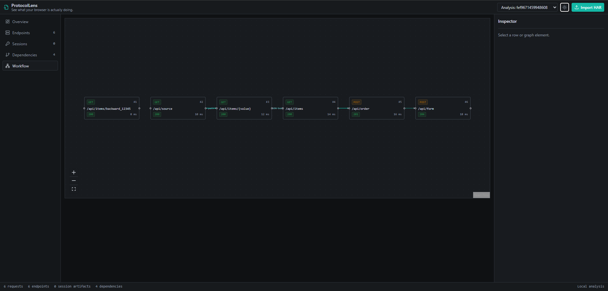
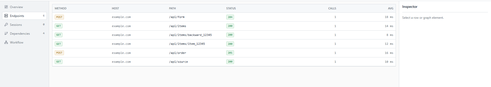

# ProtocolLens

See what your browser is actually doing.

ProtocolLens is a Go-first web workflow analysis toolkit that turns captured browser traffic into structured endpoint, session, dependency, and workflow information. The core analysis pipeline is Go; React is only the visualization layer.

## Preview





## Current capabilities

- HAR 1.2 import
- Endpoint aggregation by method, host, and path
- Session artifact detection for Cookie, Set-Cookie, Bearer, CSRF, and API key signals
- Sensitive value redaction during normalization
- Deterministic dependency inference from response JSON to later request paths, query values, JSON bodies, and form bodies
- Workflow graph construction with request-instance nodes and dependency edges
- CLI analysis
- REST API
- React visualization
- SQLite persistence
- Light/dark developer workbench UI with dense protocol tables and inspector panels
- Responsive narrow/mobile layout
- Explicit safe HTTP replay, disabled by default

## Architecture

Core analysis: Go  
Presentation: React

```text
HAR
 |
 v
Importer
 |
 v
Normalizer
 |
 +--> Endpoint Analyzer
 +--> Session Analyzer
 +--> Dependency Analyzer
 |
 v
SQLite
 |
 +--> CLI
 +--> Go HTTP API
         |
         v
      React UI
```

The workflow graph is derived from captured exchanges and dependency records; React renders it but does not own analysis logic.

See [docs/architecture.md](docs/architecture.md) and [docs/data-flow.md](docs/data-flow.md).

## Analysis output

Captured traffic can be transformed into:

- normalized endpoints
- safe session metadata
- response-to-request dependency evidence
- observable request workflow graphs

Inferred dependencies describe observable client-side data flow. They are evidence from captured traffic, not guaranteed application semantics.

## Security

- Imported HAR files are treated as untrusted input.
- Sensitive headers are redacted during normalization.
- Session and token values are not exposed through analysis APIs.
- Dependency records do not persist matched raw values.
- Workflow graph metadata remains structural only.
- HTTP replay is disabled by default and executes only after an explicit user action.
- Replay execution is ephemeral; replay requests and responses are not persisted.

ProtocolLens does not make HAR files inherently safe. Avoid importing sensitive production traffic unless it has been sanitized.

## Quick start

Start the API:

```sh
go run ./cmd/protocollens-server
```

Start the frontend:

```sh
cd web
npm install
npm run dev
```

Open the frontend at `http://localhost:5173`. The API listens on `http://localhost:8080`.


Enable replay for local development only after reviewing the target network policy:

```sh
PROTOCOLLENS_REPLAY_ENABLED=true go run ./cmd/protocollens-server
```

Default replay limits are ports `80,443`, timeout `10s`, request body `1 MiB`, response body `2 MiB`, and four concurrent replay requests.
Run a CLI analysis:

```sh
go run ./cmd/protocollens analyze examples/har/dependency.har
```

## API examples

```sh
curl -X POST --data-binary @examples/har/dependency.har http://localhost:8080/api/v1/import/har
curl http://localhost:8080/api/v1/analyses/{id}
curl http://localhost:8080/api/v1/analyses/{id}/endpoints
curl http://localhost:8080/api/v1/analyses/{id}/sessions
curl http://localhost:8080/api/v1/analyses/{id}/dependencies
curl http://localhost:8080/api/v1/analyses/{id}/workflow
curl http://localhost:8080/api/v1/analyses/{id}/requests/{requestId}/replay-template
curl -X POST http://localhost:8080/api/v1/replay
```

This is not a complete API reference; it lists the main inspection endpoints currently implemented.

## Project structure

```text
cmd/
internal/
  analyzer/
  capture/
  domain/
  graph/
  storage/
web/
examples/
docs/
```

## Development

```sh
go test ./...
go vet ./...
go build ./...
```

Frontend:

```sh
cd web
npm run lint
npm run typecheck
npm run build
```

See [docs/development.md](docs/development.md).

## Tech stack

- Go
- SQLite
- React
- TypeScript
- Vite
- React Flow
- Docker
- GitHub Actions

## Project status

ProtocolLens is under active development.

Current baseline includes HAR import, endpoint analysis, session artifact analysis, deterministic dependency inference, derived workflow graphs, SQLite persistence, CLI/API access, and a responsive React developer workbench.

Planned work includes client generators, Playwright capture, WebSocket/SSE analysis, and benchmark/browser-to-HTTP analysis.

## License

MIT License.